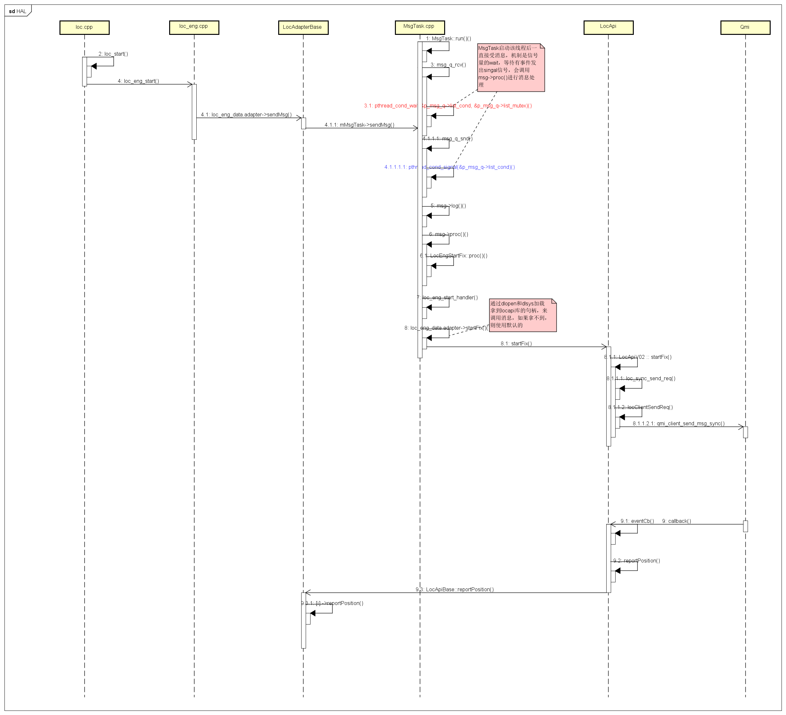

# GPS 发送命令流程 #

## LocationManager--modem流程分析 ##

### 1.1 LocationManagerService.java ###
app client调用接口<code>requestLocationUpdates</code>
<pre><code>
void requestLocationUpdates(LocationRequest request, ILocationListener listener,PendingIntent intent, String packageName) {
...
    requestLocationUpdatesLocked(sanitizedRequest, recevier, pid, uid, packageName);
}
</code></pre>

该<code>requestLocationUpdatesLocked</code>函数主要调用<code>applyRequirementsLocked</code>
<pre><code>
void requestLocationUpdatesLocked(LocationRequest request, Receiver receiver,int pid, int uid, String packageName) { 
    ....
     applyRequirementsLocked(name);
    ....
}
</code></pre>

该<code>applyRequirementsLocked</code>函数主要调用provider的<code>setRequest</code>函数
<pre><code>
void applyRequirementsLocked(String provider) {  
    ....
	p.setRequest(providerRequest, worksource);
}
</code></pre>

### 1.2 以GnssLocationProvider为例分析<code>setRequest</code>的实现 ###

该<code>enable()</code>主要是发送消息给自己的线程处理
<pre><code>
void setRequest(ProviderRequest request, WorkSource source) {  
	sendMessage(SET_REQUEST, 0, new GpsRequest(request, source));
}
</code></pre>

该线程收到上面的消息,进行内部的处理
<pre><code>
public void handleMessage(Message msg) {
	int message = msg.what;
	switch (message) {
		case ENABLE:
			if (msg.arg1 == 1) {
				handleEnable();
			} else {
					handleDisable();
			 }
			 break;
		case SET_REQUEST:
			GpsRequest gpsRequest = (GpsRequest) msg.obj;
			handleSetRequest(gpsRequest.request, gpsRequest.source);
	}
}
</code></pre>

<code>handleSetRequest</code>调用JNI层的代码
<pre><code>
public void handleSetRequest(ProviderRequest request, WorkSource source) {
	 mProviderRequest = request;
	mWorkSource = source;
	updateRequirements();
}

void updateRequirements() {
	...
	if (mProviderRequest.reportLocation && !mDisbleGps && isEnabled()) {
		mFixInterval = (int) mProviderRequest.interval;
		...
		if (mStarted && hasCapability(GPS_CAPABILITY_SCHEDULING)) {
			if (!native_set_position_mode(mPositionMode, GPS_POSITION_RECURRENCE_PERIODIC, mFixInterval, 0, 0)) {
		}
		} else if (!mStarted) {
			startNavigating(singleShot);
		}
	} else {
			stopNavigating();
	}
}

void startNavigating(boolean singleShot) {
	if (!native_set_position_mode(mPositionMode, GPS_POSITION_RECURRENCE_PERIODIC,interval, 0, 0)) {
		...
	}
	if (!native_start()) {
		...
	}
}

void stopNavigating() {
	if (mStarted) {
		native_stop();
	}
}
</code></pre>

### 1.3 JNI代码com_android_server_location_GnssLocationProvider.cpp实现 ###

<code>native_start()</code>其实就是<code>android_location_GnssLocationProvider_start()</code>
该函数主要是调用HAL的start函数
<pre><code>
static jboolean android_location_GnssLocationProvider_start(JNIEnv* /* env */, jobject /* obj */)
{
    if (sGpsInterface) {
        if (sGpsInterface->start() == 0) {
            return JNI_TRUE;
        } else {
            return JNI_FALSE;
        }
    }
    else
        return JNI_FALSE;
}
</code></pre>

### 1.3 HAL层代码实现 ###
loc.cpp
<code>sGpsInterface->start</code>实际上就是<code>loc_start()</code>
在HAL层启动的时候会创建一个thread即<code>MsgTask::run()</code>用于接收消息
在线程中使用了信号量的机制，线程一直等待通过<code>pthread_cond_wait</code>
发送消息的时候只要<code>pthread_cond_signal</code>,接收线程会被唤醒处理消息
squence图如下

