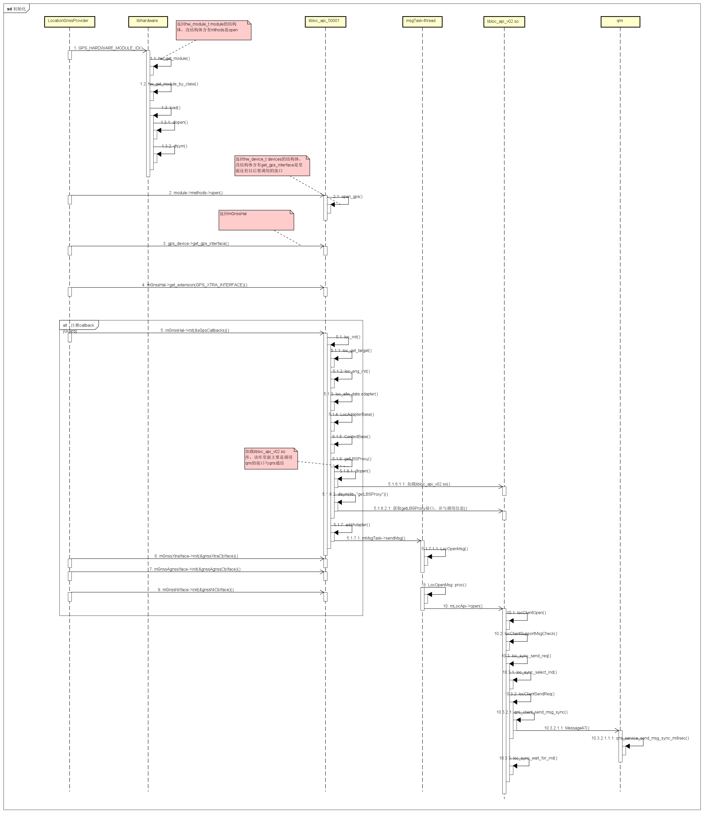

# android HAL GPS #

## GPS 初始化过程 ##

###1.HAL 模块的启动和加载

####1.1主要数据结构
<pre><code>
    hw_module_t
    hw_device_t
</code></pre>
在gps.c文件中定义了相应的结构体<code> hw_module_t HAL_MODULE_INFO_SYM</code>

<pre><code>
struct hw_module_t HAL_MODULE_INFO_SYM = {
    .tag = HARDWARE_MODULE_TAG,
    .module_api_version = 1,
    .hal_api_version = 0,
    .id = GPS_HARDWARE_MODULE_ID,
    .name = "loc_api GPS Module",
    .author = "Qualcomm USA, Inc.",
    .methods = &gps_module_methods,
};
</code></pre>

GPS\_HARDWARE\_MODULE\_ID是GPS模块的ID号，用于获取该hw\_module\_t
###1.2入口函数---加载GPS硬件模块
<pre><code>
    hw_module_t *module;
    int err = hw_get_module(GPS_HARDWARE_MODULE_ID, (hw_module_t const**)&module);
     /*
      在hw_get_module中主要完成如下工作：
      1.preperty_get获取库的名字，并检测该.so文件是否存在，如存在继续
      2.加载该so文件，通过dlopen和dlsym实现
      */
       handle = dlopen(path, RTLD_NOW);
       /* 从动态链接库中获取硬件模块结构体的指针. */
       const char *sym = HAL_MODULE_INFO_SYM_AS_STR;/*硬件模块在动态链接库中的标志*/
       hmi = (struct hw_module_t *)dlsym(handle, sym);
</code></pre>
###1.3获取GPS模块的接口--便于上层调用
<pre><code>
        hw_device_t* device;
        err = module->methods->open(module, GPS_HARDWARE_MODULE_ID, &device);
        gps_device_t* gps_device = (gps_device_t *)device;
        mGnssHal = gps_device->get_gps_interface(gps_device);
</code></pre>
gps提供给上层的主要接口的结构体如下(gps_interface.cpp)：
<pre><code>
	static const GpsInterface sGpsInterface = {
	   sizeof(GpsInterface),
	   loc_init,
	   loc_start,
	   loc_stop,
	   loc_cleanup,
	   loc_inject_time,
	   loc_inject_location,
	   loc_delete_aiding_data,
	   loc_set_position_mode,
	   loc_get_extension
	};
</code></pre>

###2.

